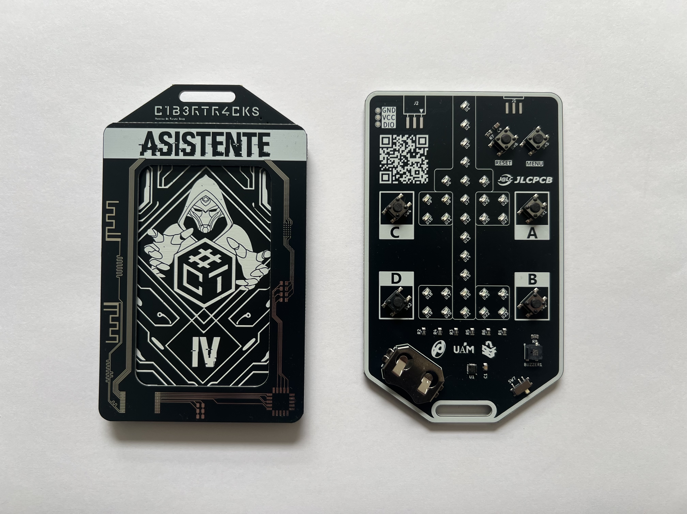

# 🛠️ C1b3rtr4cks Badge 2025

Este repositorio contiene el diseño y firmware de la **badge oficial del evento de ciberseguridad [Cibertracks](https://www.c1b3rtr4cks.es/)**. Este badge está compuesta por **tres placas PCB** ensambladas como un **sandwich**, cada una diseñada en **KiCad**. Además de su función identificativa, su forma permite utilizarla como **portatarjetas físico** para credenciales o tarjetas del evento.

---

## 🧭 Descripción del Proyecto

- 🔧 **Diseño multicapa:** 3 placas PCB ensambladas en forma de sandwich.
- 🎨 **Diseño personalizado:** Adaptada para representar visualmente la identidad del evento.
- 💾 **Firmware en C:** Corre en un **CH32V003**, un microcontrolador RISC-V.
- 🪪 **Funcionalidad dual:** Badge electrónica + portatarjetas físico.

---

## 🧩 Hardware

La placa está diseñada en tres capas, cada una como un proyecto independiente en **KiCad**:

- **badge2025**: Capa frontal. Incluye LEDs, botones y detalles gráficos del evento.
- **middle_frame**: Elemento mecánico que actua como separador y de retenedor de tarjetas.
- **front_frame**: Capa frontal que extiende el diseño de la placa principal.

Estas capas se ensamblan de forma compacta, resultando en una badge robusta y funcional, apta para colgar con lanyard o sujetar una tarjeta del evento.

---

## 💻 Firmware

El firmware está ubicado en `software` y está desarrollado en **C** usando **PlatformIO**.

Se trata de una serie de minijuegos a los que se puede jugar con otra persona juntando dos placas. 

### 📦 Requisitos

- [PlatformIO](https://platformio.org/)
- Programador compatible con CH32V003 (ej. WCH-LinkE, USB-UART + BOOT0)

## ▶️ ¿Cómo usar la placa?

En la siguiente [página](HOW-TO-USE.md) encontramos instrucciones de como usar la placa y jugar con ella. 
